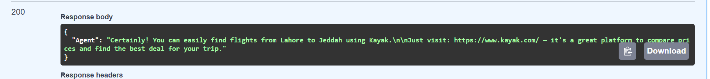
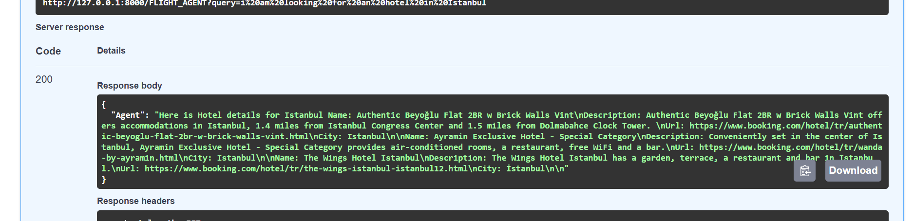
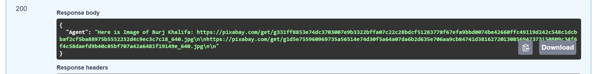
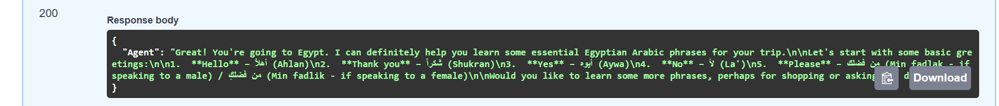
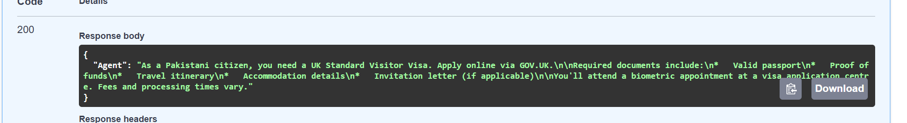
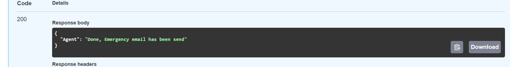
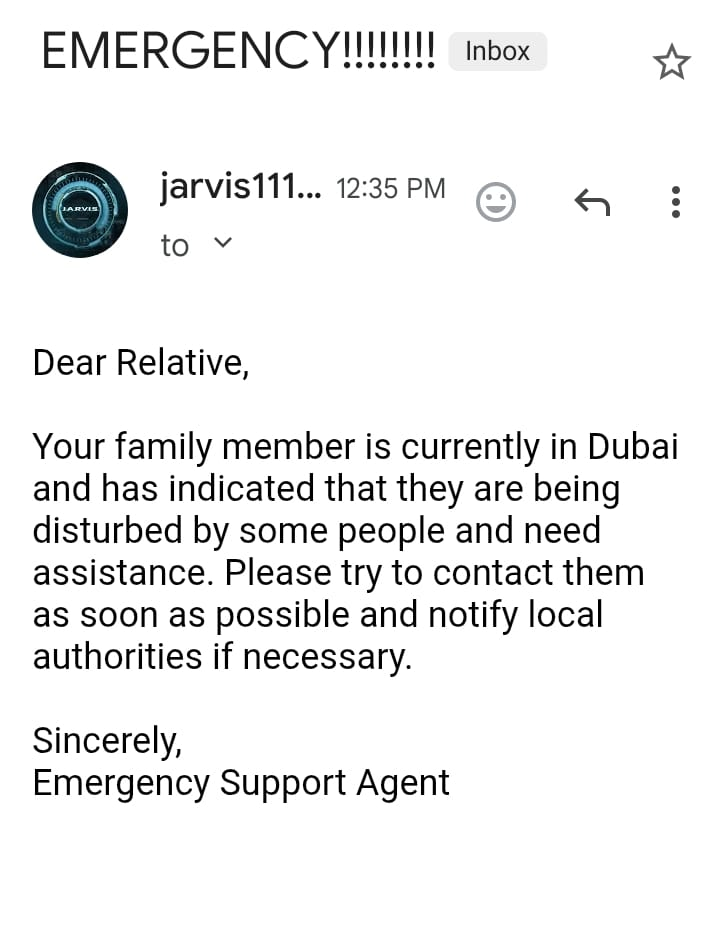
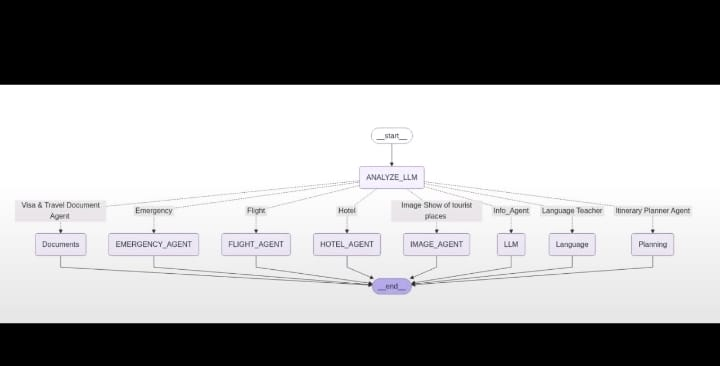

# ✈️ AI-Powered Flight Agent  

**_An all-in-one AI travel assistant that plans trips, books flights & hotels, teaches local languages, shows destination images, and ensures your safety — all powered by multi-agent AI systems._**  

---

## 💡 How This Idea Came  
While planning a trip, I realized how **fragmented** the process is:  

- ✈️ Flight booking on one website  
- 🏨 Hotel booking on another  
- 🗣 Language learning on a separate app  
- 🚨 Emergency contacts stored elsewhere  

I thought:  
> _"What if one AI agent could do all of this seamlessly in one place?"_  

That question became **_Flight Agent_** — your one-stop AI travel companion.  

---

## 🌍 Why We Need This  
Travel isn’t just about getting from **point A to point B** — it’s about making the journey **stress-free**.  

**The problem today:**  
- ❌ Tools are disconnected  
- ❌ No emergency integration in trip planners  
- ❌ Learning local phrases requires a separate app  

**Flight Agent solves this by providing:**  
✔️ A **single AI interface** for all travel needs  
✔️ **Emergency safety alerts** built-in  
✔️ Integrated **language learning** and trip planning  

---

## 🚀 About the Project  

**_Flight Agent is an AI-powered multi-agent system that can:_**  
- 🗺 **Plan your trip** — suggest destinations & itineraries  
- 🏛 **Provide location info** — history, attractions, travel tips  
- 🗣 **Teach local languages** — essential travel phrases  
- 🖼 **Show destination images** — via Pixabay API  
- ✈️ **Book flights** — using integrated APIs  
- 🏨 **Book hotels** — find & reserve accommodations  
- 🚨 **Inform relatives in case of emergency** — auto-email alerts via SMTP  

---

## 🛠 Tech Stack  

| **Category**       | **Tools / Libraries** |
|--------------------|-----------------------|
| **AI & Agents**    | Google Gemini, LangChain, LangGraph |
| **Automation**     | Python Scripting, APIs |
| **Communication**  | SMTP (Email Sending) |
| **Image Search**   | Pixabay API |
| **Data Processing**| JSON, REST APIs |
| **Environment**    | Python 3.x, Virtualenv |

---

## ⚙️ How It Works  

1. **User Input** → Destination, travel dates, preferences  
2. **Trip Planner Agent** → Generates itinerary with Gemini & LangChain  
3. **Location Info Agent** → Fetches details about the destination  
4. **Language Agent** → Teaches essential local phrases  
5. **Image Agent** → Fetches destination images using Pixabay API  
6. **Flight Booking Agent** → Searches & reserves flights  
7. **Hotel Booking Agent** → Finds and books accommodations  
8. **Emergency Contact Agent** → Sends safety alerts to relatives  

---

## 📸 Screenshots / Demo

**Flight Booking**  
  


**Hotel Booking**  
  


**Destination Images**  
  


**Language Learning Module**  
  


**Generated Travel Document**  
  


**Emergency Alert System**  
  


**Email Response Confirmation**  



**System Graph**


SMTP_EMAIL=your_email
SMTP_PASSWORD=your_password


## 📥 Installation & Setup  

```bash
# Clone the repository
git clone https://github.com/MuhammadHamza123c/FLIGHT_AGENT.git
cd FLIGHT_AGENT

# Create virtual environment
python -m venv venv
source venv/bin/activate   # On Windows: venv\Scripts\activate

# Install dependencies
pip install -r requirements.txt

# Add API keys in .env file
GEMINI_API_KEY=your_gemini_key
PIXABAY_API_KEY=your_pixabay_key

